#Performance Analysis of Deep Learning Models for Sentiment Classification Analysis on IMDB Dataset

## Overview
This project evaluates the performance of six deep learning models (FFNNs, CNNs, LSTMs, BiLSTMs) for sentiment classification using the IMDB dataset. The study investigates the impact of optimizers (SGD, Adam, Adagrad) and training epochs on model performance.

## Dataset
We are using a dataset for binary sentiment classification containing substantially more data than previous benchmark datasets. We provide a set of 25,000 highly polar movie reviews for training, and 25,000 for testing. There is additional unlabeled data for use as well. Raw text and already processed bag of words formats are provided. See the README file contained in the release for more details. 
Credits: https://ai.stanford.edu/~amaas/data/sentiment/ 

## Key Findings
1. **Adagrad Optimizer**: Best test accuracy (73.28%) and lowest test loss (0.572).
2. **20 Epochs**: Balanced generalization with a test accuracy of 70.71% and test loss of 0.593.
3. **One-layer FFNN with Adam**: Outperformed other architectures in this experiment.

## Experiment Results
### Optimizer Comparison
- **Loss and Accuracy**:
  - Evaluated the performance of SGD, Adam, and Adagrad optimizers.

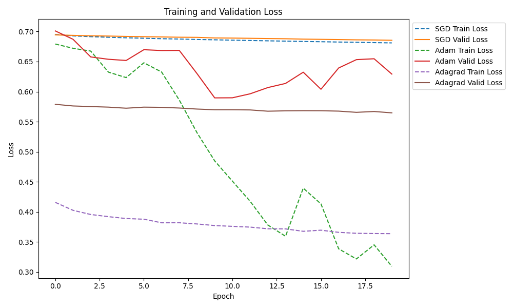
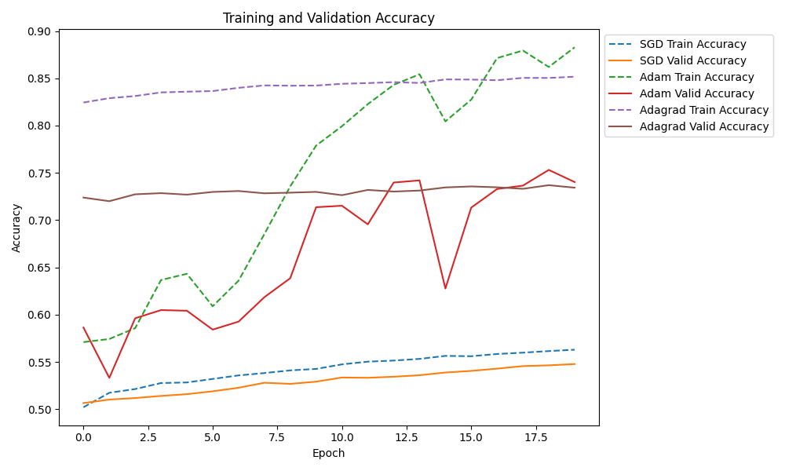

- **Comparison**:
  - Visualizes test loss and accuracy for the optimizers.

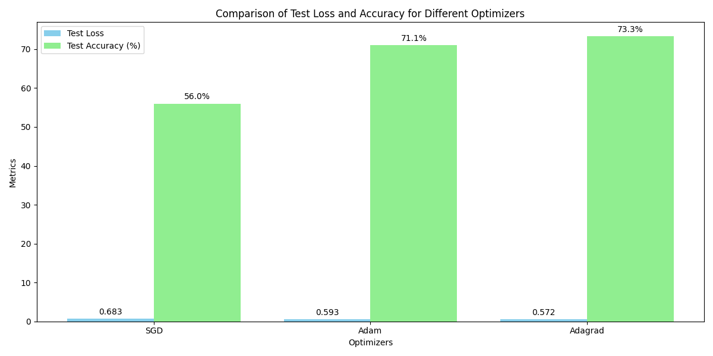

### Epoch Variation
- **Loss and Accuracy**:
  - Explores the effect of different epoch configurations (5, 10, 20, 50).

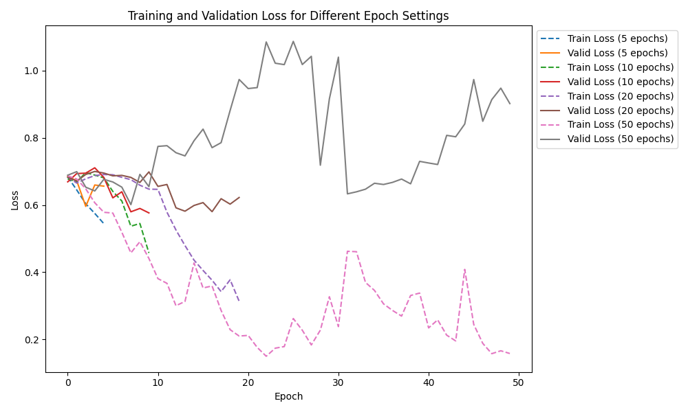
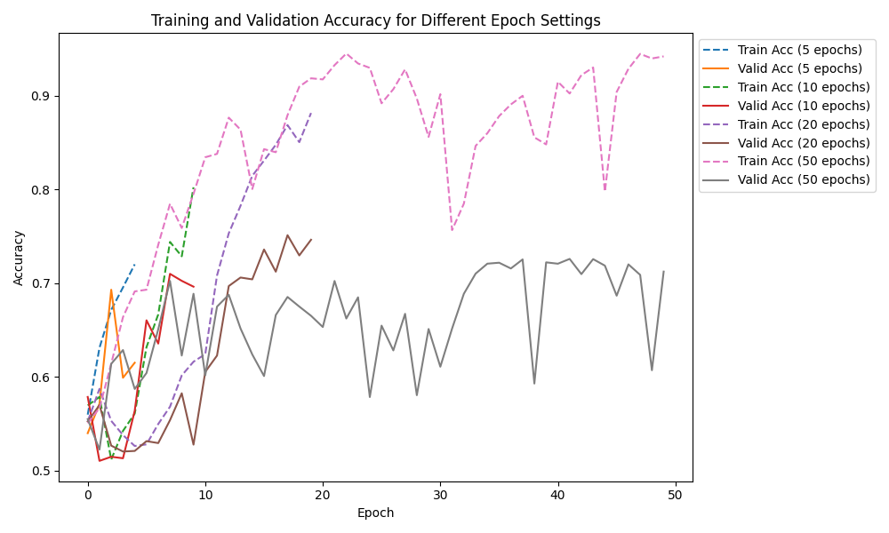

- **Comparison**:
  - Summarizes the test loss and accuracy across different epochs.

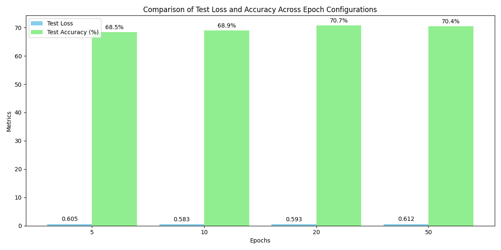

### Model Comparison
- **Loss and Accuracy**:
  - Compares performance of six model architectures (One-layer FFNN, Two-layer FFNN, Three-layer FFNN, CNN, LSTM, BiLSTM).

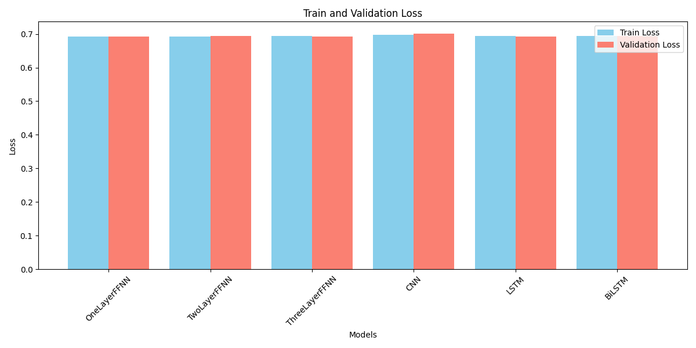
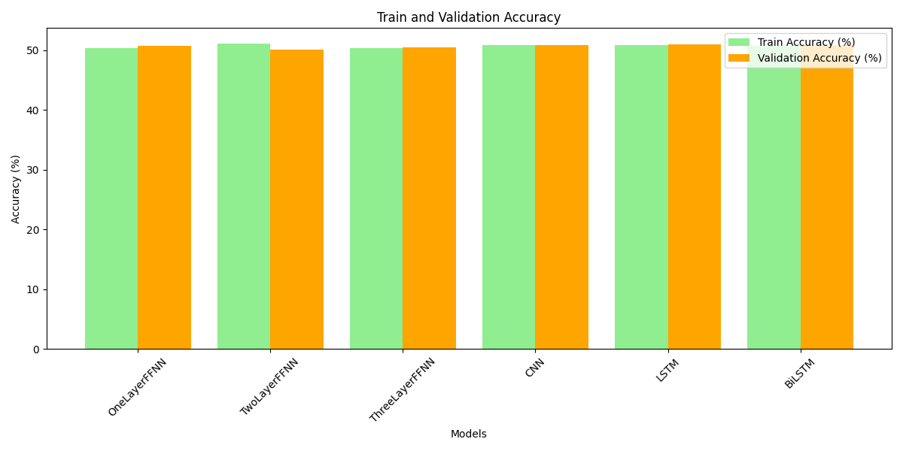

- **Training Trends**:
  - Highlights training and validation loss/accuracy trends for the models.

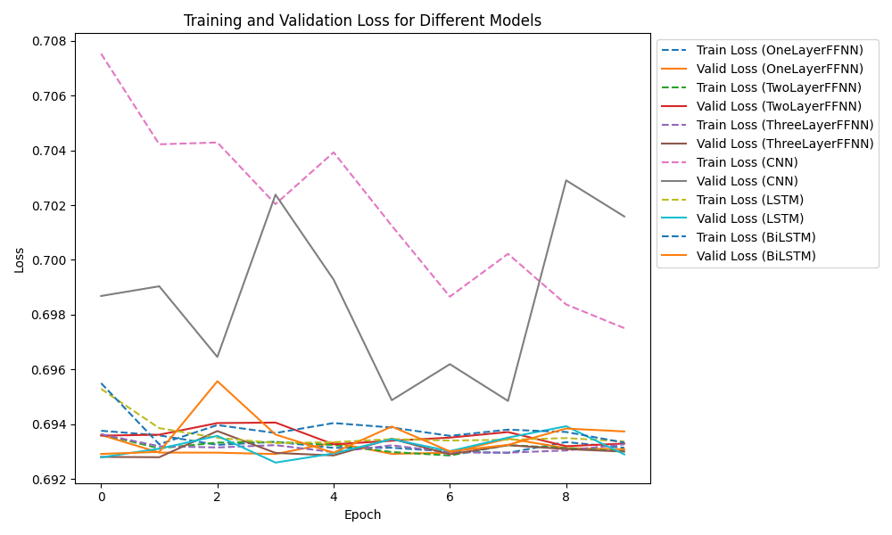
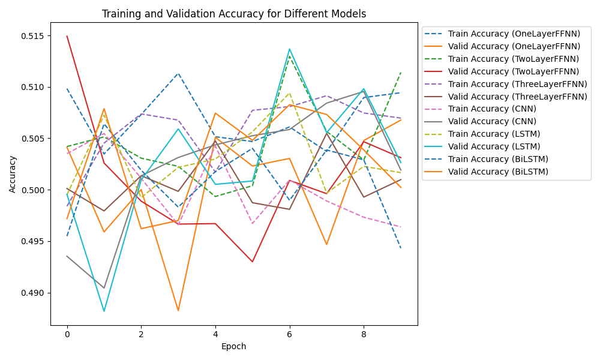

- **Comparison**:
  - Summarizes test loss and accuracy for each model.

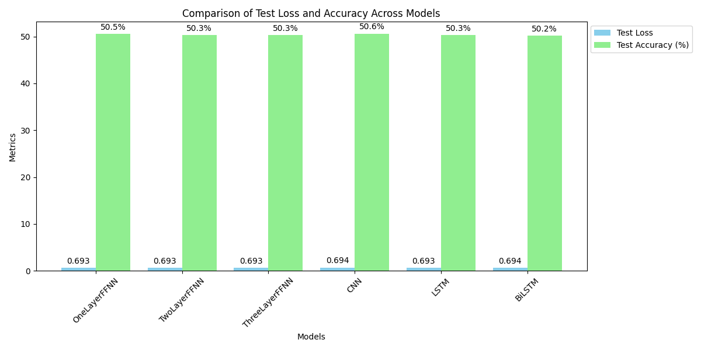


## Requirements
- Python 3.8+
- TensorFlow, Keras, Matplotlib, NumPy, Pandas

Install dependencies:
```
pip install -r requirements.txt
```
